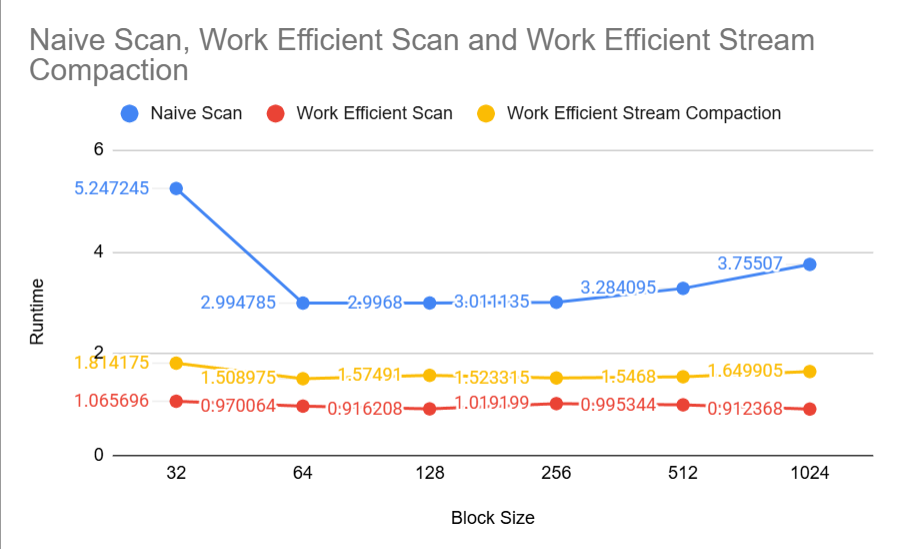
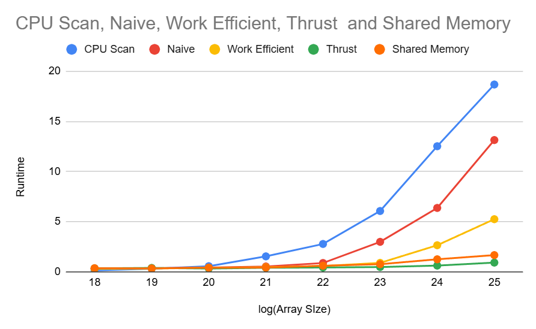
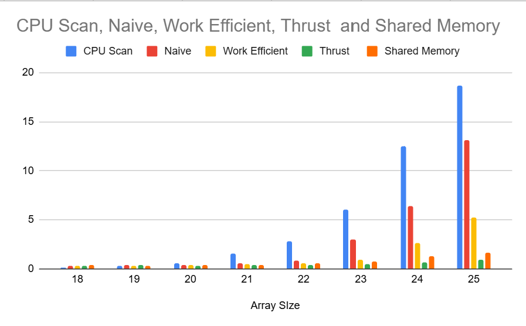
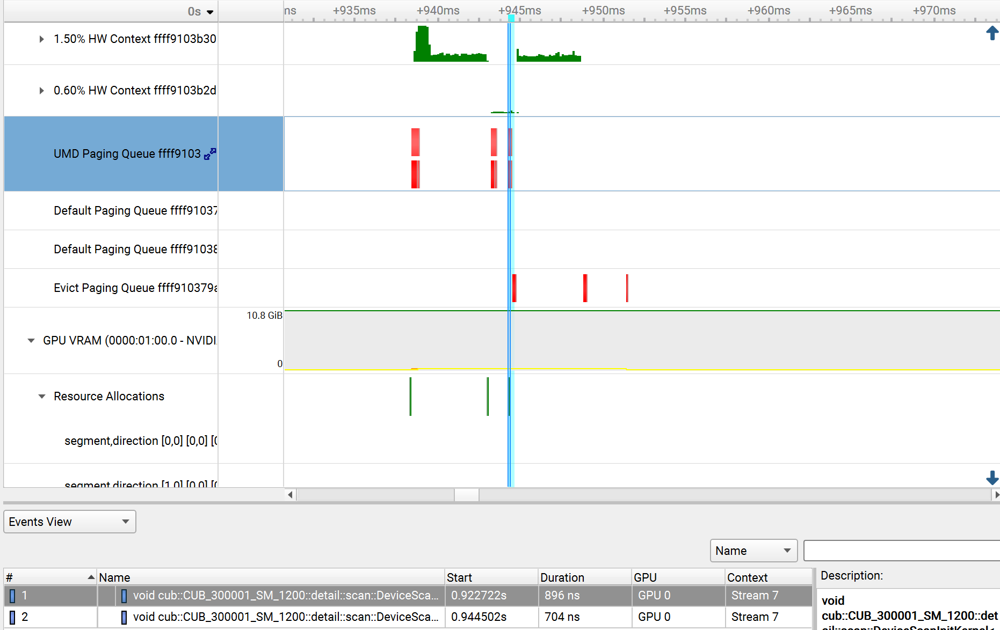
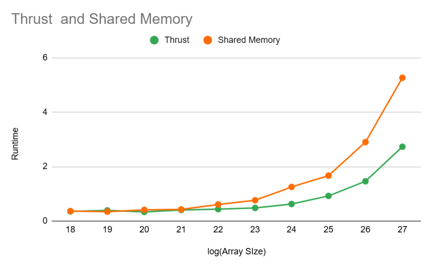

CUDA Stream Compaction
======================

**University of Pennsylvania, CIS 565: GPU Programming and Architecture, Project 2**

* Yuntian Ke
* Tested on: Windows 11, Intel Core Ultra 9 275HX @ 2.70GHz 32GB, RTX 5070 Ti 30160MB

## Implemented Features
### 1. CPU Scan & Stream Compaction
This is used as the expected value for the other tests, and compared with GPU methods.  

### 2. Naive GPU Scan
Use the "Naive" algorithm to do the exclusive scan. At every level $d$, when $k \geq 2^{d-1}$, do x[k] = x[k - $2^{d-1}$] + x[k]. Then just change this inclusive scan to exclusive scan. 

### 3. Work-Efficient GPU Scan & Stream Compaction
Use the "Work-Efficient" algorithm to do the exclusive scan and stream compaction. For scan part, use a balanced binary tree to perform scan in Up-Sweep and Down-Sweep. For Stream Compaction part, first get the bool array, then do the exclusive scan we just implemented, and finally do Scatter. 

### 4. Thrust's Implementation
Use thrust::exclusive_scan(first, last, result) to finish this.

### 5. GPU Scan Using Shared Memory
I implemented this with original Work-Efficient GPU Scan. To enable this setting, you can just set "ENABLE_SHARED_MEMORY==1"

## Performance Analysis
<p align="center">
  
  <br/>
  <b>Figure 1:</b> Block Size Optimization
</p>
### Roughly optimize the block sizes of each of your implementations for minimal run time on your GPU
I do roughly Block Size Optimization on size $2^{23}$, and run each blocksize 3 times to get the average runtime. It shows that, when block size = 32, all three implementations will get the worst runtime. When block size = 64, 128, 256, their perfromances are quite similar, the difference of runtime is very small. For Naive scan and Work Efficient Scan, when increasing block size to 512 and 1024, the performance will be a little bit worse than block size = 64, 128, 256's. For Work Efficient Stream Compaction, all performances are close when block size is larger than 32. So, for all 3 implementations, I set block size = 256.

### Compare all of these GPU Scan implementations (Naive, Work-Efficient, and Thrust) to the serial CPU version of Scan
<p align="center">
  
  
  <br/>
  <b>Figure 2:</b> Scan Performance
</p>


From the data I collected, it shows that when Array Size is smaller or equal than $2^{20}$, all those implementations have close performance; while Array Size getting larger, Thrust Scan have the best performance. GPU Scan Using Shared Memory is better than original Work-Efficient GPU Scan, and close to Thrust's performance.

### Guess at what might be happening inside the Thrust implementation
<p align="center">
  
  <br/>
  <b>Figure 3:</b> Nsight System Anaylsis
</p>
The Nsight Systems timeline for Thrust shows DeviceScanInitKernel and DeviceScanKernel surrounded by driver “resource allocation” and UMD paging events. This suggests Thrust (via CUB) requires a temporary workspace that the driver must allocate and make resident on the GPU before the scan runs.

<p align="center">
  
  <br/>
  <b>Figure 4:</b> Thrust vs Shared Memory GPU Scan
</p>

### Brief explanation of the phenomena 

CPU Scan (blue) grows steeply: runtime increases superlinearly as array size doubles. By $2^{25}$, it’s ~20 ms.
Naive GPU (red) is faster than CPU but still grows quickly; multiple global memory reads/writes per element dominate.
Work-Efficient GPU (yellow) improves scaling: fewer redundant operations, less wasted memory traffic, so growth is slower. Shared-Memory GPU Scan (orange) is close to Thrust at small–medium sizes and stays far below Naive and Work-Efficient methods at larger size. Thrust (green) is consistently best: sub-millisecond even at $2^{25}$.  

### Performance Bottlenecks
- CPU Scan → computation-bound: it’s a serial loop with no parallelism; every element adds cost.
- Naive GPU Scan → memory I/O-bound: each step does redundant reads/writes across the whole array. Even though GPU is parallel, global memory traffic dominates.
- Work-Efficient GPU Scan → still memory-bound, but much better use of parallelism: each element is moved fewer times;. Computation isn’t the limiter here, memory access patterns are.
- Shared-Memory GPU Scan → also memory-bound, but with minimal DRAM traffic (just one load + one store per element). Most work happens in shared memory; runtime is capped by global bandwidth rather than arithmetic.

### Why Shared Memory Scan is faster than original Work-Efficient Scan?
The shared-memory scan is faster because it minimizes global memory traffic (just one load/store per element), does all tree operations in on-chip shared memory, and avoids repeated kernel launches. The original global work-efficient scan was still memory-bound, but with much higher DRAM traffic.

### Test Output

```
****************
** SCAN TESTS **
****************
    [  34  32  34  21  13   7   8   8  18   4  49   7  43 ...  18   0 ]
==== cpu scan, power-of-two ====
   elapsed time: 5.7368ms    (std::chrono Measured)
    [   0  34  66 100 121 134 141 149 157 175 179 228 235 ... 205433928 205433946 ]
==== cpu scan, non-power-of-two ====
   elapsed time: 3.9875ms    (std::chrono Measured)
    [   0  34  66 100 121 134 141 149 157 175 179 228 235 ... 205433850 205433880 ]
    passed
==== naive scan, power-of-two ====
   elapsed time: 3.39638ms    (CUDA Measured)
    passed
==== naive scan, non-power-of-two ====
   elapsed time: 2.90432ms    (CUDA Measured)
    passed
==== work-efficient scan, power-of-two ====
   elapsed time: 0.775456ms    (CUDA Measured)
    passed
==== work-efficient scan, non-power-of-two ====
   elapsed time: 0.752288ms    (CUDA Measured)
    passed
==== thrust scan, power-of-two ====
   elapsed time: 0.476736ms    (CUDA Measured)
    passed
==== thrust scan, non-power-of-two ====
   elapsed time: 0.419232ms    (CUDA Measured)
    passed

*****************************
** STREAM COMPACTION TESTS **
*****************************
    [   2   0   1   2   1   2   0   3   2   2   3   3   2 ...   3   0 ]
==== cpu compact without scan, power-of-two ====
   elapsed time: 15.9244ms    (std::chrono Measured)
    [   2   1   2   1   2   3   2   2   3   3   2   2   3 ...   2   3 ]
    passed
==== cpu compact without scan, non-power-of-two ====
   elapsed time: 15.9825ms    (std::chrono Measured)
    [   2   1   2   1   2   3   2   2   3   3   2   2   3 ...   1   2 ]
    passed
==== cpu compact with scan ====
   elapsed time: 36.1649ms    (std::chrono Measured)
    [   2   1   2   1   2   3   2   2   3   3   2   2   3 ...   2   3 ]
    passed
==== work-efficient compact, power-of-two ====
   elapsed time: 1.62368ms    (CUDA Measured)
    passed
==== work-efficient compact, non-power-of-two ====
   elapsed time: 1.40934ms    (CUDA Measured)
    passed
```
